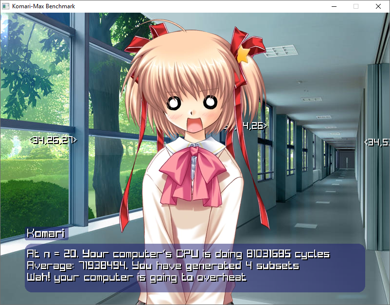

# Komari Max Benchmark- Watch Komari Kamikita from Little Busters crash out as you put a 2^n algorithm in a game loop

## On Assets
because im using copyrighted material, i cannot directly put the sprites and audio in the repo. Place the following files in the `assets` folder:
- background.jpg
- ehe.wav
- fue.wav
- wah.wav
- komariAtlas.png
- slowCurve.mp3

## Compilation
raylib is included in the repo. run `make` to compile the program

## Credits
- [Timer Helpers](https://github.com/raylib-extras/examples-c/discussions/2)
